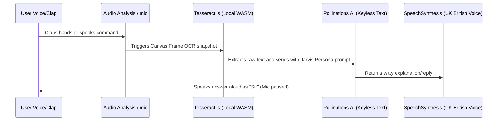

# 🌌 ANICADE VISION — Advanced Screen Reader & Voice Assistant

<div align="center">
  
  <!-- Interactive Animated Logo & Header (Embedded SVG) -->
  <svg width="450" height="180" viewBox="0 0 450 180" fill="none" xmlns="http://www.w3.org/2000/svg">
    <style>
      .orb {
        fill: url(#orb-grad);
        filter: url(#glow);
        animation: pulse 2.5s infinite alternate ease-in-out;
      }
      .ring-outer {
        stroke: #C6A85C;
        stroke-dasharray: 450;
        stroke-dashoffset: 450;
        animation: draw-ring 4s forwards cubic-bezier(0.4, 0, 0.2, 1), spin-ring 15s infinite linear;
        transform-origin: 225px 90px;
      }
      .ring-inner {
        stroke: #00BFFF;
        stroke-dasharray: 300;
        stroke-dashoffset: 300;
        animation: draw-ring 3s 1s forwards cubic-bezier(0.4, 0, 0.2, 1), spin-ring-rev 10s infinite linear;
        transform-origin: 225px 90px;
      }
      .text-title {
        font-family: 'Orbitron', 'Rajdhani', sans-serif;
        font-weight: 900;
        fill: #C6A85C;
        font-size: 26px;
        letter-spacing: 4px;
        text-anchor: middle;
      }
      .text-subtitle {
        font-family: 'Rajdhani', sans-serif;
        font-weight: 500;
        fill: #94A3B8;
        font-size: 13px;
        letter-spacing: 2px;
        text-anchor: middle;
      }
      @keyframes pulse {
        0% { r: 35px; opacity: 0.7; }
        100% { r: 42px; opacity: 0.95; }
      }
      @keyframes draw-ring {
        to { stroke-dashoffset: 0; }
      }
      @keyframes spin-ring {
        to { transform: rotate(360deg); }
      }
      @keyframes spin-ring-rev {
        to { transform: rotate(-360deg); }
      }
    </style>

    <defs>
      <!-- Glow filter -->
      <filter id="glow" x="-50%" y="-50%" width="200%" height="200%">
        <feGaussianBlur stdDeviation="8" result="blur" />
        <feMerge>
          <feMergeNode in="blur" />
          <feMergeNode in="SourceGraphic" />
        </feMerge>
      </filter>
      <!-- Orb Gradient -->
      <radialGradient id="orb-grad" cx="50%" cy="50%" r="50%">
        <stop offset="0%" stop-color="#00BFFF" />
        <stop offset="70%" stop-color="#005B9A" stop-opacity="0.6" />
        <stop offset="100%" stop-color="#0B1C2D" stop-opacity="0" />
      </radialGradient>
    </defs>

    <!-- Outer Decorative Spinning Ring -->
    <circle class="ring-outer" cx="225" cy="90" r="70" stroke-width="1.5" stroke-linecap="round" />
    <!-- Inner Decorative Reverse-Spinning Ring -->
    <circle class="ring-inner" cx="225" cy="90" r="54" stroke-width="1" stroke-dasharray="20 10" />
    
    <!-- Central Pulsing Speech Orb -->
    <circle class="orb" cx="225" cy="90" r="38" />

    <!-- Brand Texts -->
    <text class="text-title" x="225" y="145">ANICADE VISION</text>
    <text class="text-subtitle" x="225" y="165">SCREEN REPLAY & SPEECH INTELLIGENCE</text>
  </svg>

  <p>
    
    
    
  </p>
</div>

---

## 🌌 Overview

**ANICADE VISION** is a state-of-the-art screen reader and AI companion designed to provide seamless visual assistance across desktop and mobile browsers. Replicating the premium branding of **ANICADE TECH** (Zambia), the application translates graphical inputs (like homework slides, chat messages, or interfaces) into speech using advanced non-Chinese English voices, controlled entirely via interactive voice commands.

---

## ⚡ Main Capabilities

1. **Multi-Input Visualizer Feed**
   - **Share Desktop Screen**: Cast any window or browser tab directly to the AI reader.
   - **Camera Scanner**: Point your mobile rear camera at sheets of papers, documents, or monitor screens.
   - **Screenshot Upload**: Simply upload snapshots from mobile storage for precise OCR.
2. **Client-Side OCR (Zero API Key Setup)**
   - Powered by local `Tesseract.js` executing WebAssembly text-recognition directly in your browser.
   - Extracted text is fed to a keyless Pollinations AI Text model (`https://text.pollinations.ai/openai`) with custom system prompts to act as Jarvis.
   - Allows fully automated homework assistance, chat replies, and summarization without any configuration or cost.
3. **Advanced British voice Profile**
   - Synthesizes speech with premium British English (`en-GB`) locales (e.g. Daniel, Google UK English Male/Female).
   - Addresses the user politely as **"Sir"** with Tony Stark's personal assistant personality.
4. **Hands-free Clap Activation**
   - Web Audio API microphone level processing.
   - Wake Jarvis instantly from standby mode by simply clapping your hands!
5. **Immersive Full Screen Orb Mode**
   - Holographic HUD overlay that expands the Orb to fill the viewport.
   - Optimized for mobile phone screens and hands-free desktop voice controls.
6. **Creative Image Ad Generator**
   - Reads text on screen, drafts a visual advertising script, and renders a high-end marketing banner from Pollinations.ai image generator.
   - Includes full download/save functionality.
7. **PWA Installation & Mic Loop Prevention**
   - Prevents AI response feedback loop by pausing SpeechRecognition when SpeechSynthesis is talking.
   - Standalone application installation with offline Service Worker asset caching.

---

## 🗣️ Active Voice Command Reference

Simply speak any of the following command keywords to let the assistant execute the task:

| Voice Command | Action Executed | Context Area |
| :--- | :--- | :--- |
| **"read screen"** or **"read"** | Run local Tesseract OCR, summarize, and speak. | General OCR |
| **"school help"** / **"solve math"** | Explain visual math equations or slide notes step-by-step. | Academics |
| **"auto reply"** / **"suggest reply"** | Read social chat text and propose Whatsapp-style replies. | Social / Chat |
| **"generate ad for [product]"** | Draw screen keywords and spawn a marketing image banner. | Ad Generator |
| **"voice typing"** or **"start typing"** | Enter Dictation notebook. Voice is typed continuously into the text field. | Writing Pad |
| **"stop typing"** or **"exit notebook"** | Save dictation notes and return to general command routing. | Writing Pad |
| **"clear note"** / **"copy note"** | Clear notebook field or copy content to operating system clipboard. | Notebook |
| **"install app"** | Trigger local Progressive Web App installation prompt. | Configuration |
| **"stop listening"** / **"standby"** | Pause microphone speech recognition. | State Control |

---

## 🛠️ Tech Architecture Flow



---

## 🚀 Simple Quick-Start Instructions

### Step 1: Clone or Copy files
Ensure the following files are stored in the same folder directory:
- `index.html` (Layout interface)
- `styles.css` (Glassmorphism design tokens)
- `app.js` (Media & Voice Engine script)
- `manifest.json` (PWA metadata)
- `sw.js` (Offline cache registry)

### Step 2: Launch Dev Server
Progressive Web App media captures (`getDisplayMedia` & `getUserMedia`) require a secure context (**HTTPS** or **localhost**). You can run a simple server:
```powershell
# Using Python
python -m http.server 8000

# Using Node.js
npx live-server
```
Navigate to `http://localhost:8000` or `http://127.0.0.1:8000` in Google Chrome, Microsoft Edge, or Apple Safari.

### Step 3: PWA Installation
1. Once launched, look at the top header.
2. If your browser is compatible, a golden **Install App** button will animate into view.
3. Tap it to add **ANICADE VISION** directly as a native system program.
