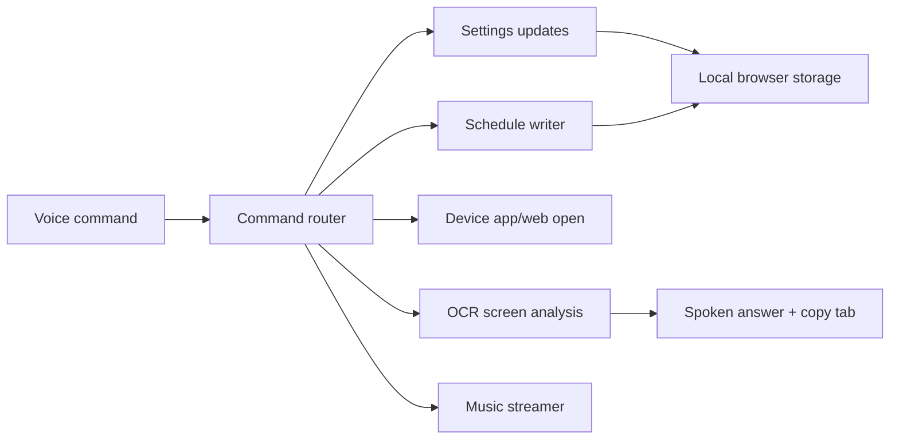

# ANICADE VISION

<div align="center">
  <svg width="620" height="210" viewBox="0 0 620 210" fill="none" xmlns="http://www.w3.org/2000/svg">
    <style>
      .ring { transform-origin: 310px 82px; animation: spin 18s linear infinite; }
      .ring2 { transform-origin: 310px 82px; animation: spinReverse 11s linear infinite; }
      .scan { animation: scan 2.4s ease-in-out infinite; }
      .orb { animation: pulse 1.8s ease-in-out infinite alternate; filter: url(#glow); }
      .title { font-family: Orbitron, Arial, sans-serif; font-size: 30px; font-weight: 800; fill: #C6A85C; letter-spacing: 5px; text-anchor: middle; }
      .sub { font-family: Arial, sans-serif; font-size: 13px; fill: #94A3B8; letter-spacing: 2px; text-anchor: middle; }
      @keyframes spin { to { transform: rotate(360deg); } }
      @keyframes spinReverse { to { transform: rotate(-360deg); } }
      @keyframes pulse { from { opacity: .7; r: 31; } to { opacity: 1; r: 43; } }
      @keyframes scan { 0%,100% { transform: translateY(-32px); opacity: .25; } 50% { transform: translateY(32px); opacity: .95; } }
    </style>
    <defs>
      <filter id="glow" x="-80%" y="-80%" width="260%" height="260%">
        <feGaussianBlur stdDeviation="9" result="blur"/>
        <feMerge><feMergeNode in="blur"/><feMergeNode in="SourceGraphic"/></feMerge>
      </filter>
      <radialGradient id="orb" cx="50%" cy="50%" r="50%">
        <stop offset="0%" stop-color="#00BFFF"/>
        <stop offset="70%" stop-color="#006EA6" stop-opacity=".72"/>
        <stop offset="100%" stop-color="#0B1C2D" stop-opacity="0"/>
      </radialGradient>
    </defs>
    <rect x="180" y="22" width="260" height="120" rx="18" fill="#06101C" stroke="#1E3A5F"/>
    <circle class="ring" cx="310" cy="82" r="62" stroke="#C6A85C" stroke-width="1.5" stroke-dasharray="18 10"/>
    <circle class="ring2" cx="310" cy="82" r="44" stroke="#00BFFF" stroke-width="1.2" stroke-dasharray="10 8"/>
    <circle class="orb" cx="310" cy="82" r="35" fill="url(#orb)"/>
    <rect class="scan" x="205" y="80" width="210" height="2" fill="#00BFFF"/>
    <text class="title" x="310" y="172">ANICADE VISION</text>
    <text class="sub" x="310" y="194">VOICE-ACTIVATED SCREEN READER, ASSISTANT, AND PWA</text>
  </svg>

  <br>
  
  
  
</div>

## What It Does

ANICADE VISION is a browser-based assistant that reads screens, scans uploaded images, answers voice questions, writes reminders into its own schedule panel, opens supported apps or web fallbacks, streams music, and keeps copy-ready answer output.

## Capability Map



## Voice Commands

| Say | Result |
| --- | --- |
| `set wake word to computer` | Updates the wake word and writes it into settings |
| `change persona to mentor` | Switches assistant personality |
| `light mode` / `dark mode` | Changes the theme |
| `particles off` / `particles on` | Toggles stardust, bokeh, embers, and orb particles |
| `add schedule project review at 3:30 PM` | Writes a reminder into the schedule panel |
| `clear schedules` | Removes saved reminders |
| `share screen` | Opens the browser screen-share prompt |
| `read screen` | Runs OCR and speaks/saves the answer |
| `open file` | Opens a file picker and reads supported local files |
| `open WhatsApp` / `open calendar` | Attempts app protocol, then opens web fallback where available |
| `reply to message I am running late` | Drafts a quick message reply |
| `search web for solar eclipse` | Reads a live instant web result or opens search fallback |
| `read website https://example.com` | Summarizes readable website text |
| `play music`, `next track`, `volume up` | Controls the music streamer |
| `system check` | Reports speech, microphone, media, cache, and OCR status |

## Visual System

The interface uses three layered background effects:

- Interactive stardust canvas that reacts to pointer movement
- Soft cinematic bokeh with a pulsing glow hub
- Rising ember particles for motion and depth

All effects are controlled by the same particle setting, including voice commands.

## Local-First Privacy

Conversation logs, answer output, schedules, wake word, persona, and UI settings are stored in browser `localStorage`. API keys and optional cloud sync remain code-side in `app.js`, not exposed in the settings UI.

## Run Locally

Use any static server from this folder:

```powershell
npx http-server . -p 8000
```

Then open:

```text
http://127.0.0.1:8000
```

Media capture features require `localhost`, `127.0.0.1`, or HTTPS.

## Files

| File | Purpose |
| --- | --- |
| `index.html` | App shell, controls, metadata, manual tabs |
| `styles.css` | Layout, HUD design, responsive styles, effects |
| `app.js` | Voice commands, OCR, schedules, app opening, music, settings |
| `manifest.json` | Installable PWA metadata |
| `sw.js` | Cache-first static shell and network-first API handling |
| `robots.txt` / `sitemap.xml` | Search discovery |
