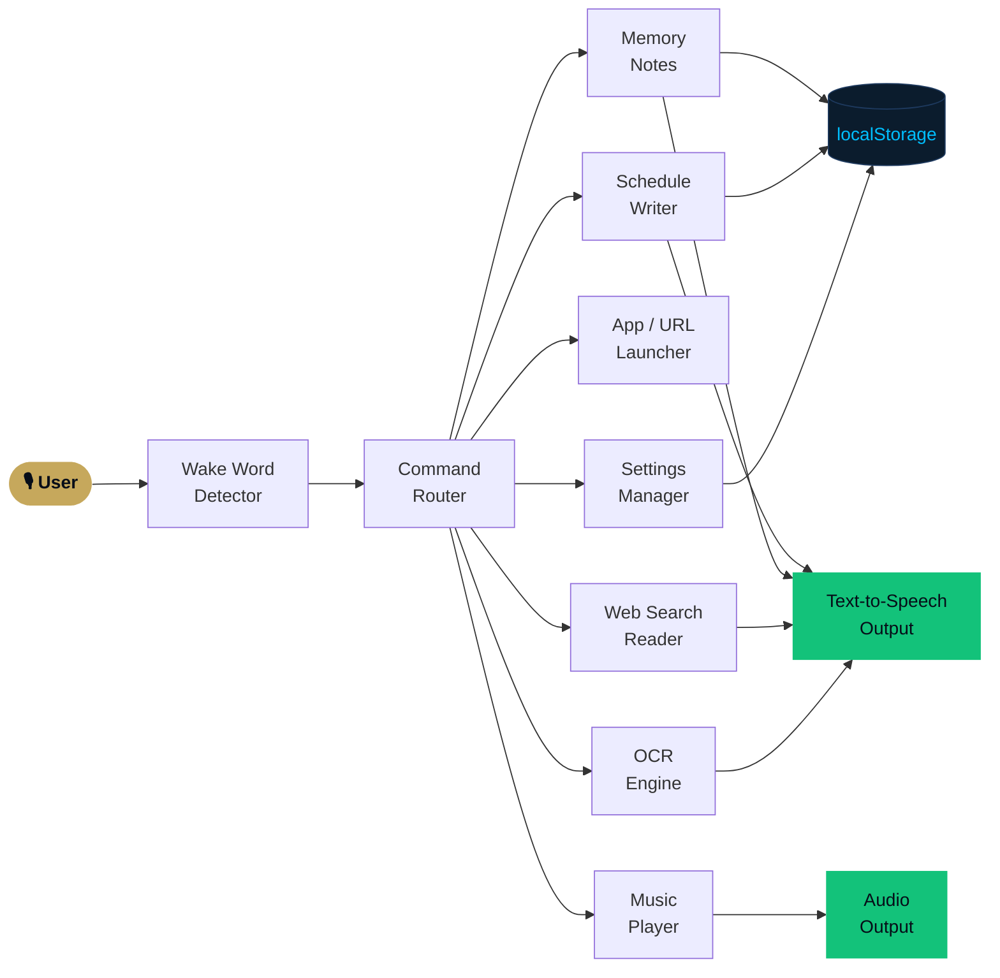

<div align="center">

<svg width="680" height="230" viewBox="0 0 680 230" fill="none" xmlns="http://www.w3.org/2000/svg">
  <style>
    .ring  { transform-origin: 340px 95px; animation: spin        18s linear      infinite; }
    .ring2 { transform-origin: 340px 95px; animation: spinReverse 11s linear      infinite; }
    .ring3 { transform-origin: 340px 95px; animation: spin        28s linear      infinite; }
    .scan  { animation: scan  2.4s ease-in-out infinite; }
    .orb   { animation: pulse 1.8s ease-in-out infinite alternate; filter: url(#glow); }
    .title { font-family: 'Orbitron', Arial Black, sans-serif; font-size: 32px; font-weight: 900;
             fill: #C6A85C; letter-spacing: 6px; text-anchor: middle; }
    .sub   { font-family: Arial, sans-serif; font-size: 11px; fill: #64829E;
             letter-spacing: 3.5px; text-anchor: middle; }
    .tag   { font-family: 'Space Mono', monospace, Arial, sans-serif; font-size: 10px;
             fill: #00BFFF; letter-spacing: 2px; text-anchor: middle; opacity: 0.8; }
    @keyframes spin        { to { transform: rotate( 360deg); } }
    @keyframes spinReverse { to { transform: rotate(-360deg); } }
    @keyframes pulse { from { opacity:.65; } to { opacity:1; } }
    @keyframes scan  { 0%,100%{transform:translateY(-38px);opacity:.2;} 50%{transform:translateY(38px);opacity:.9;} }
  </style>
  <defs>
    <filter id="glow" x="-80%" y="-80%" width="260%" height="260%">
      <feGaussianBlur stdDeviation="11" result="blur"/>
      <feMerge><feMergeNode in="blur"/><feMergeNode in="SourceGraphic"/></feMerge>
    </filter>
    <filter id="softglow" x="-40%" y="-40%" width="180%" height="180%">
      <feGaussianBlur stdDeviation="4" result="blur"/>
      <feMerge><feMergeNode in="blur"/><feMergeNode in="SourceGraphic"/></feMerge>
    </filter>
    <radialGradient id="orbGrad" cx="50%" cy="50%" r="50%">
      <stop offset="0%"   stop-color="#00BFFF" stop-opacity=".95"/>
      <stop offset="55%"  stop-color="#006EA6" stop-opacity=".6"/>
      <stop offset="100%" stop-color="#0B1C2D" stop-opacity="0"/>
    </radialGradient>
    <radialGradient id="panelGrad" cx="50%" cy="0%" r="100%">
      <stop offset="0%"   stop-color="#0F2540"/>
      <stop offset="100%" stop-color="#060D18"/>
    </radialGradient>
    <linearGradient id="goldLine" x1="0%" y1="0%" x2="100%" y2="0%">
      <stop offset="0%"   stop-color="#C6A85C" stop-opacity="0"/>
      <stop offset="50%"  stop-color="#C6A85C"/>
      <stop offset="100%" stop-color="#C6A85C" stop-opacity="0"/>
    </linearGradient>
    <linearGradient id="cyanLine" x1="0%" y1="0%" x2="100%" y2="0%">
      <stop offset="0%"   stop-color="#00BFFF" stop-opacity="0"/>
      <stop offset="50%"  stop-color="#00BFFF"/>
      <stop offset="100%" stop-color="#00BFFF" stop-opacity="0"/>
    </linearGradient>
  </defs>

  <!-- Background panel -->
  <rect x="150" y="10" width="380" height="155" rx="20" fill="url(#panelGrad)" stroke="#1E3A5F" stroke-width="1.2"/>
  <!-- Corner accents -->
  <polyline points="152,30 152,12 172,12" stroke="#C6A85C" stroke-width="1.5" fill="none" opacity="0.7"/>
  <polyline points="528,30 528,12 508,12" stroke="#C6A85C" stroke-width="1.5" fill="none" opacity="0.7"/>
  <polyline points="152,145 152,163 172,163" stroke="#C6A85C" stroke-width="1.5" fill="none" opacity="0.7"/>
  <polyline points="528,145 528,163 508,163" stroke="#C6A85C" stroke-width="1.5" fill="none" opacity="0.7"/>

  <!-- Outer ring (gold dashed) -->
  <circle class="ring"  cx="340" cy="95" r="72" stroke="#C6A85C" stroke-width="1.4" stroke-dasharray="22 12"/>
  <!-- Mid ring (cyan dashed) -->
  <circle class="ring2" cx="340" cy="95" r="52" stroke="#00BFFF" stroke-width="1.1" stroke-dasharray="12 9"/>
  <!-- Inner slow ring -->
  <circle class="ring3" cx="340" cy="95" r="34" stroke="#1E3A5F" stroke-width="1"   stroke-dasharray="6 6"/>

  <!-- Orb glow core -->
  <circle class="orb" cx="340" cy="95" r="38" fill="url(#orbGrad)"/>

  <!-- Central icon: eye shape -->
  <ellipse cx="340" cy="95" rx="18" ry="10" stroke="#00BFFF" stroke-width="1.4" fill="none" filter="url(#softglow)" opacity="0.9"/>
  <circle  cx="340" cy="95" r="5"   fill="#00BFFF" opacity="0.9" filter="url(#softglow)"/>

  <!-- Scan line -->
  <rect class="scan" x="175" y="93" width="330" height="2" rx="1" fill="#00BFFF" opacity="0.7"/>

  <!-- Divider lines -->
  <rect x="175" y="168" width="330" height="1" rx="0.5" fill="url(#goldLine)"/>
  <rect x="175" y="171" width="330" height="0.5" rx="0.5" fill="url(#cyanLine)" opacity="0.4"/>

  <!-- Text -->
  <text class="title" x="340" y="192">ANICADE VISION</text>
  <text class="sub"   x="340" y="210">VOICE · OCR · ASSISTANT · PWA</text>
  <text class="tag"   x="340" y="225">by ANICADE TECH™</text>
</svg>

<br>

<!-- Badge row 1: core identity -->


<!-- Badge row 2: stack -->


</div>

---

<div align="center">
<sub>
A browser-based AI assistant that reads your screen, takes voice commands, writes schedules, streams music, runs OCR on images, and installs as a PWA — all without a backend.
</sub>
</div>

---

## ◈ Overview

**ANICADE VISION** is a fully offline-capable, voice-driven browser assistant built as part of the **ANICADE TECH™** ecosystem. It requires no server, no native app install, and no cloud account to operate.

| Capability | Detail |
|---|---|
| 🎙️ **Voice Engine** | Wake-word listener with continuous speech recognition |
| 🔍 **Screen Reader** | Share your screen → runs Tesseract.js OCR → speaks result |
| 📅 **Scheduler** | Voice-written reminders stored in localStorage |
| 🌐 **Web Intelligence** | Live search queries + readable website summaries |
| 🎵 **Music Streamer** | Built-in player with playlist, shuffle, and repeat modes |
| 📱 **PWA Shell** | Installable on Android/Desktop with offline cache |
| 🧠 **Memory Notes** | Save and recall personal notes by voice |
| 🎨 **Particle System** | Three-layer visual FX: stardust, bokeh, embers |

---

## ◈ Architecture



---

## ◈ Voice Command Reference

<details>
<summary><strong>⚙️ Settings & Persona</strong></summary>

| Command | Effect |
|---|---|
| `set wake word to [word]` | Updates the trigger word and persists it |
| `change persona to [name]` | Switches assistant personality style |
| `light mode` / `dark mode` | Toggles the UI theme |
| `particles off` / `particles on` | Enables or disables all particle layers |

</details>

<details>
<summary><strong>📅 Schedules & Memory</strong></summary>

| Command | Effect |
|---|---|
| `add schedule [task] at [time]` | Writes a timed reminder to the schedule panel |
| `list schedules` | Reads all saved schedule entries aloud |
| `clear schedules` | Removes all saved reminders |
| `remember [note]` | Saves a memory note to localStorage |
| `what do you remember` | Reads back all stored memory notes |

</details>

<details>
<summary><strong>🔍 Screen & File Reading</strong></summary>

| Command | Effect |
|---|---|
| `share screen` | Opens the browser screen-share prompt |
| `read screen` | Runs OCR on the shared screen and speaks the result |
| `open file` | Opens a file picker and reads supported local files |
| `read website [url]` | Fetches and summarizes readable website content |

</details>

<details>
<summary><strong>🌐 Web & App Control</strong></summary>

| Command | Effect |
|---|---|
| `search web for [query]` | Returns a live instant answer or opens search fallback |
| `open WhatsApp` | Attempts app protocol → falls back to web.whatsapp.com |
| `open calendar` | Opens your calendar app or web fallback |
| `reply to message [text]` | Drafts a quick reply message |

</details>

<details>
<summary><strong>🎵 Music Player</strong></summary>

| Command | Effect |
|---|---|
| `play music` | Starts the built-in playlist |
| `play: [track title]` | Plays a specific track by name |
| `next track` / `previous track` | Skips forward or back |
| `volume up` / `volume down` | Adjusts playback volume |
| `repeat this song` | Loops the current track |
| `repeat playlist` | Loops the full playlist |
| `repeat off` | Disables all looping |
| `list songs` | Reads the current playlist aloud |

</details>

<details>
<summary><strong>🛠️ System & Diagnostics</strong></summary>

| Command | Effect |
|---|---|
| `system check` | Reports speech engine, microphone, media, cache, and OCR status |
| `what can you do` | Reads a quick guide of available commands |

</details>

---

## ◈ Visual System

The interface runs three independent, voice-controllable particle layers simultaneously:

```
┌─────────────────────────────────────────────────────────┐
│  Layer 3 — EMBER PARTICLES   Rising motion, depth cues  │
│  Layer 2 — BOKEH GLOW        Pulsing soft light orbs    │
│  Layer 1 — STARDUST CANVAS   Pointer-reactive particles │
└─────────────────────────────────────────────────────────┘
```

All three layers respond to the same `particles on/off` voice command and the settings toggle. The stardust layer additionally reacts to **mouse/touch movement** in real time.

---

## ◈ Privacy — Local First

> ANICADE VISION stores everything on your device. Nothing is sent to any server during normal use.

| Data | Storage Location |
|---|---|
| Conversation history | `localStorage` |
| Schedules & reminders | `localStorage` |
| Memory notes | `localStorage` |
| Wake word & persona | `localStorage` |
| UI theme & settings | `localStorage` |
| API keys (optional) | `app.js` — never in the UI |

---

## ◈ Getting Started

### Requirements

- Any modern browser (Chrome or Edge recommended for full Speech API support)
- A local static server OR HTTPS hosting (required for microphone + screen capture)

### Run Locally

```powershell
# Using Node http-server
npx http-server . -p 8000
```

Then open:

```
http://127.0.0.1:8000
```

> **Note:** Media capture (microphone, screen share) requires either `localhost`, `127.0.0.1`, or an HTTPS origin. Plain `file://` will not work.

### Install as PWA

Open the app in Chrome or Edge, then click **Install** in the browser address bar — or use the in-app install prompt. The service worker caches the full shell for offline use.

---

## ◈ File Structure

```
anicade-vision/
│
├── index.html       ← App shell, UI controls, metadata, manual tabs
├── styles.css       ← HUD layout, particle effects, responsive design
├── app.js           ← Voice engine, OCR, scheduler, music, app launcher
│
├── manifest.json    ← PWA metadata (name, icons, display mode)
├── sw.js            ← Service worker: cache-first shell, network-first API
│
├── robots.txt       ← Search crawler configuration
└── sitemap.xml      ← Search discovery sitemap
```

---

## ◈ Technology Stack

| Layer | Technology |
|---|---|
| Voice Recognition | Web Speech API (`SpeechRecognition`) |
| Text-to-Speech | Web Speech API (`SpeechSynthesis`) |
| OCR Engine | [Tesseract.js](https://github.com/naptha/tesseract.js) |
| Screen Capture | `getDisplayMedia()` API |
| Offline Cache | Service Worker + Cache Storage API |
| PWA Install | Web App Manifest |
| Data Persistence | `localStorage` |
| Music Playback | HTML5 `<audio>` + JS controller |

---

## ◈ Browser Compatibility

| Feature | Chrome | Edge | Firefox | Safari |
|---|---|---|---|---|
| Speech Recognition | ✅ Full | ✅ Full | ⚠️ Partial | ⚠️ Partial |
| Screen Share + OCR | ✅ | ✅ | ✅ | ❌ iOS limited |
| PWA Install | ✅ | ✅ | ⚠️ | ⚠️ |
| Service Worker | ✅ | ✅ | ✅ | ✅ |
| Text-to-Speech | ✅ | ✅ | ✅ | ✅ |

> Chrome or Edge on desktop gives the best full-feature experience.

---

## ◈ Roadmap

- [ ] Cloud sync option (Firebase / JSONBin toggle)
- [ ] Multi-language OCR support
- [ ] Custom wake word model (offline keyword spotting)
- [ ] Schedule notifications via Notification API
- [ ] WhatsApp / Telegram message drafting integration
- [ ] ANICADE community events sync

---

<div align="center">

<svg width="480" height="2" viewBox="0 0 480 2" xmlns="http://www.w3.org/2000/svg">
  <defs>
    <linearGradient id="footerLine" x1="0%" y1="0%" x2="100%" y2="0%">
      <stop offset="0%"   stop-color="#C6A85C" stop-opacity="0"/>
      <stop offset="40%"  stop-color="#C6A85C"/>
      <stop offset="60%"  stop-color="#00BFFF"/>
      <stop offset="100%" stop-color="#00BFFF" stop-opacity="0"/>
    </linearGradient>
  </defs>
  <rect width="480" height="2" rx="1" fill="url(#footerLine)"/>
</svg>

<br>

**Built by [ANICADE TECH™](https://www.anicadetech.xyz)** · Kabwe, Zambia

*Part of the ANICADE ecosystem — Anime · Tech · Innovation*

[](https://www.anicadetech.xyz)
[](https://wa.me/260777083995)

<sub>© 2026 ANICADE TECH™ · All rights reserved</sub>

</div>