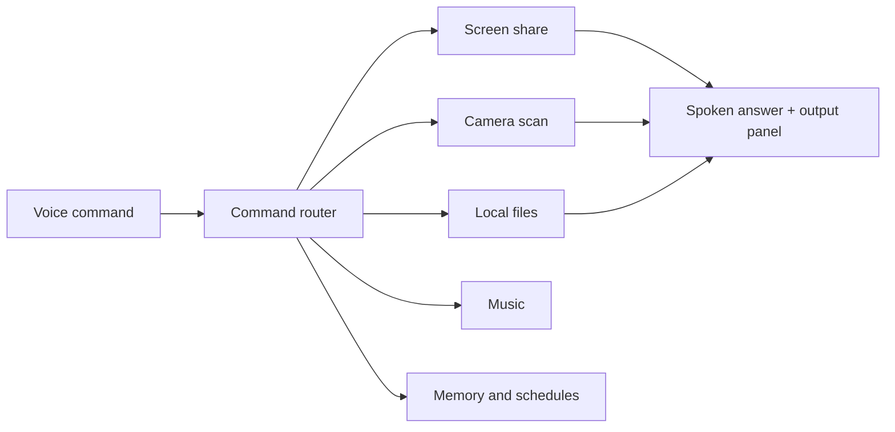

# ANICADE JARVIS

<div align="center">
  

  <h3>Voice-first screen reader, visual assistant, and installable PWA</h3>

  <p>
    
    
    
  </p>
</div>

ANICADE JARVIS is a browser-based assistant designed around the v2.1 PRD: the orb is the main interface, voice is the primary input, and camera/screen/file actions can be triggered without hunting through manual controls. Captions are off by default so your speech and JARVIS replies do not mix on screen.

## Quick Start

### Run On A PC

Download or clone the repo, then double-click:

```text
start-anicade.bat
```

Or run it from PowerShell:

```powershell
.\start-anicade.ps1
```

The launcher starts a local static server and opens the app at `http://127.0.0.1:8000/index.html`. Camera, microphone, screen sharing, and PWA install prompts work best on `localhost`, `127.0.0.1`, or HTTPS.

Recommended browser: Chrome or Edge. Firefox does not support the same browser speech-recognition API, and some mobile browsers restrict voice, camera, local folders, and screen share.

### Run With npm

```powershell
npm start
```

If PowerShell blocks npm scripts on your PC, run:

```powershell
npm.cmd start
```

Then open:

```text
http://127.0.0.1:8000
```

### Install On Phone

1. Deploy the repo to GitHub Pages or another HTTPS host.
2. Open the site in Chrome, Edge, or Safari on the phone.
3. Use the browser menu and choose `Add to Home Screen` or `Install app`.
4. Allow microphone and camera permissions when JARVIS asks.

## GitHub Pages

This repo includes `.github/workflows/pages.yml`. Push to `main` or `master`, enable GitHub Pages from Actions, and the workflow publishes the static app.

Private keys should go into GitHub repository secrets, not committed files:

```text
GEMINI_API_KEY
CLAUDE_API_KEY
GOOGLE_CLIENT_ID
FACEBOOK_APP_ID
JSONBIN_ID
JSONBIN_KEY
JSONBIN_ACCESS_KEY
```

For local development, copy `config.example.js` to `config.js`. The real `config.js` is ignored by git.

If a real key has ever been pasted into chat, screenshots, commits, or a public page, rotate that key in the provider dashboard before using the app.

## Configuration

1. Copy `config.example.js` to `config.js`.
2. Fill only the services you plan to use.
3. Keep `showCaptions: false` unless you are debugging voice recognition.
4. Use `OPENWEATHER_API_KEY_2` for the second OpenWeather key. Do not write two string values into one property.
5. Google OAuth Client IDs should look like `...apps.googleusercontent.com`, without `https://` at the front.

## Voice Core

| Say | Result |
| --- | --- |
| `JARVIS` / `Hey JARVIS` | Wake acknowledgement |
| `Go to sleep` / `Standby` | Dims the orb and waits for wake word |
| `Wake up` | Leaves standby |
| `Stop` / `Enough` | Cancels speech |
| `Change voice to Friday` | Switches to a matching browser voice |
| `List voices` | Speaks available voice names |
| `Open camera` | Starts the rear camera |
| `Front camera` | Starts the front camera |
| `Switch camera` | Flips front/rear camera |
| `Camera scan` | Opens camera and reads the frame |
| `Take a photo` | Saves the active visual frame |
| `Close camera` | Stops the camera stream |
| `Share screen` | Opens the browser screen-share prompt |
| `Read screen` | Runs visual OCR/AI analysis |
| `Open file` | Opens the local file picker |
| `Open manual` / `Show help` | Reveals the instructions manual |
| `Open maps` / `Map of Lusaka` | Opens the maps surface and docks the orb |
| `Start video chat` | Opens a video meeting page |
| `Show tools` | Reveals contextual panels |
| `Install app` | Opens the PWA install prompt when available |

## Reminders And Automation

Local reminders work while the app is open in the browser or installed PWA.

1. Say `enable notifications` or allow notifications when prompted.
2. Say `remind me to check email tomorrow at 9 AM`.
3. Keep the app open for browser-only reminders. Fully background tasks need a backend/push service or a desktop app.

## What It Can Do



## Project Files

| File | Purpose |
| --- | --- |
| `index.html` | Static app shell and contextual panels |
| `styles.css` | Orb UI, tech background, responsive layout |
| `app.js` | Voice routing, speech, camera, OCR, memory, PWA logic |
| `manifest.json` | Installable PWA metadata |
| `sw.js` | Offline app shell service worker |
| `config.example.js` | Safe public config template |
| `start-anicade.ps1` / `start-anicade.bat` | PC launchers |
| `.github/workflows/pages.yml` | GitHub Pages deployment |

## Notes

This is a static app. There is no Node/Express backend in production. Anything secret belongs in local `config.js` or GitHub Actions secrets, never in committed source. A public frontend cannot truly hide API keys from users, so production deployments should proxy paid or sensitive APIs through a backend.
